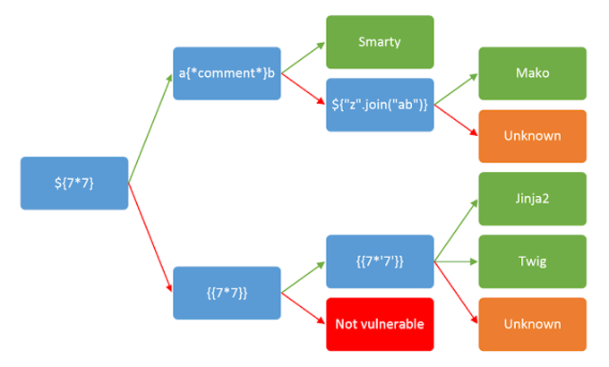

## SSTI vuln

Ref : https://www.cobalt.io/blog/a-pentesters-guide-to-server-side-template-injection-ssti

There's a tool whose code can be read to understand the basics. I forked it to extend it later [at link](https://github.com/everrover/tplmap-ctfs).

Also. [PayloadAllTheThings-sLINK](https://github.com/swisskyrepo/PayloadsAllTheThings/blob/master/Server%20Side%20Template%20Injection/Python.md)

For general cases, fuzz for a possible SSTI vuln param `${{<%[%'"}}%\.` and check for errors.

Then follow the CS for most common ones. Then we can switch to `tplmap-ctfs`

TBD : I'll automate this flow completely.