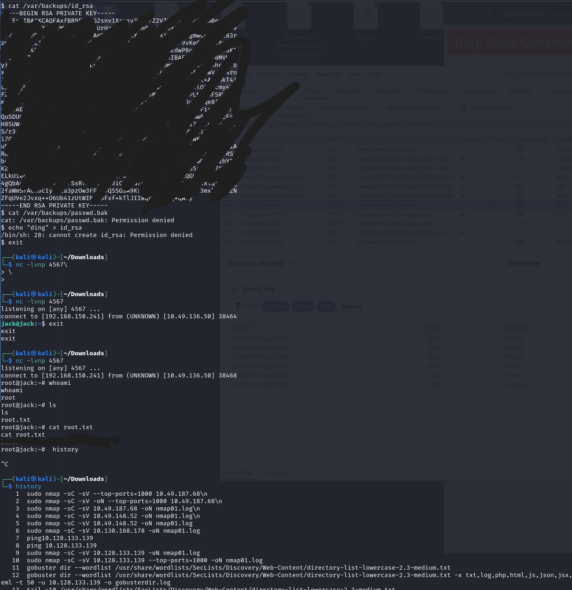

## Jack

Was a breeze. Simple `wpscan` and `rockyou.txt` to gain foothold.
    Add `jack.thm` to `/etc/host` with IP addr
    Tested the webpage, got hints of WordPress. So `wpscan`.
    Found three users, then enumerated the passwords with `wpscan` and `rockyou.txt`. 
    Got into wordpress console.
Elevated privileges by intercepting the request to update profile with `ure_other_roles=administrator` and modifying the plugin to get a reverse shell. `nc -nlvp 4567` to listen.
    Found the `user.txt` in `/home/jack/`. Found using `find / -name user.* -type f 2>/dev/null`
    Current user is `www-data`, found no sudo privileges. no relevant SUID binaries with `find / -perm -u=s -type f 2>/dev/null` and more similar searches
    Also found the `id_rsa` private key in `/home/jack` somewhere
    Used the private key to SSH into the box as `jack` user. `ssh -i id_rsa jack@<IP_ADDRESS>`
    Again looked for sudo privileges and similar things. Nth!
Hint: `python`. Looked for python scripts `find / -name *.py -type f 2>/dev/null | grep -v "Permissions denied"`. Found all to either have root access or via `family` group. `jack` was part of `family` group. 

Modded `os.py` in `/usr/lib/python2.7/` with hopes that a request to webpage or plugin would trigger the script and give a reverse shell. Worked but got a shell as `www-data`/`jack`/`wendy` user. Not `root`

While waiting my reverse shell got a hit on it's own as `root`. Must've been a cron job with some python scripts. Found access to `/root/root.txt`.

