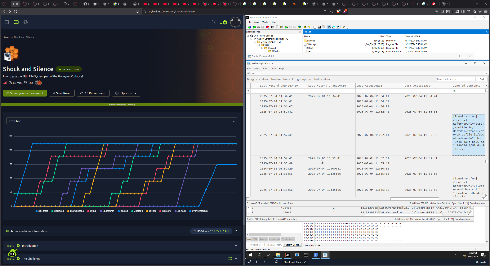
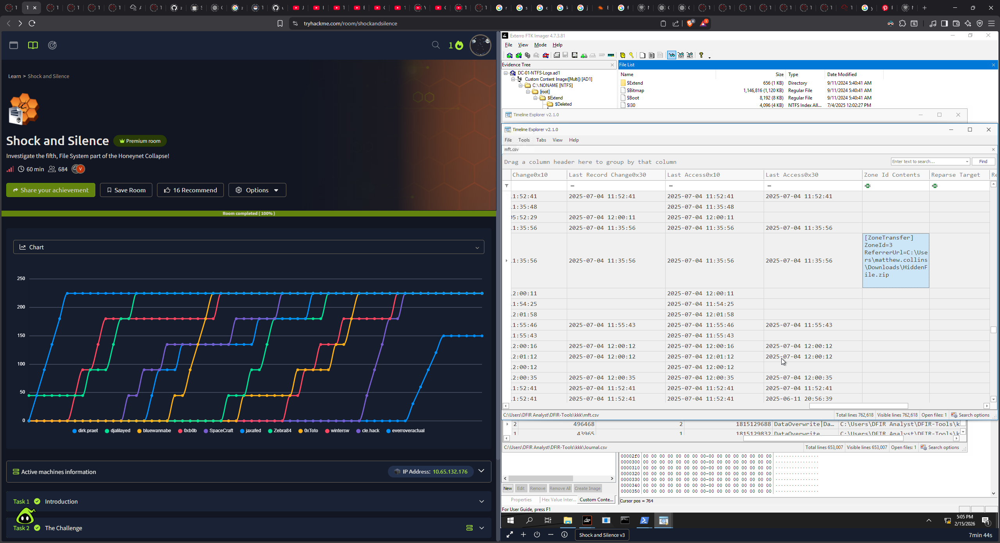
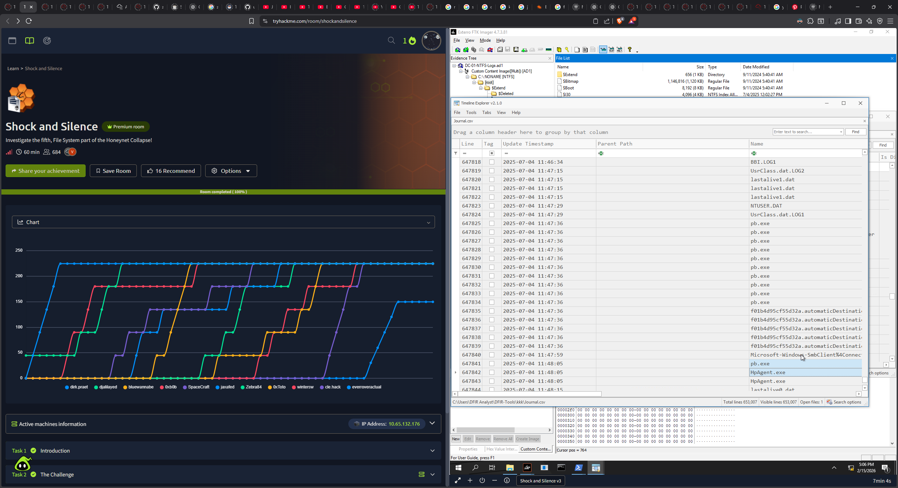
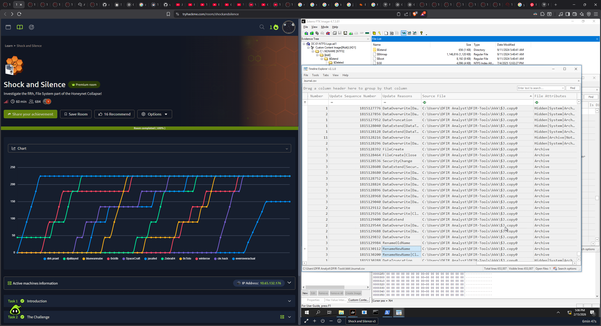
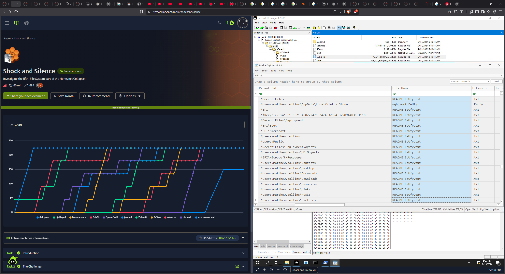

### Extracting MFT, Journal, and LogFile data using MFTECmd and LogFileParser

Used the tool to export the Master File Table (MFT), NTFS Journal, and LogFile from the copied files. Then converted the outputs to CSV format for easier analysis via **TimeLine Explorer**.

Three tools were provided so checked for the associated files: `$MFT.copy0`, `$J.copy0`, and `$LogFile.copy0`.

```ps
.\MFTECmd.exe -f 'C:\Users\DFIR Analyst\DFIR-Tools\kkk\$MFT.copy0' --csv 'C:\Users\DFIR Analyst\DFIR-Tools\kkk' --csvf mft.csv

.\MFTECmd.exe -f 'C:\Users\DFIR Analyst\DFIR-Tools\kkk\$J.copy0' --csv 'C:\Users\DFIR Analyst\DFIR-Tools\kkk' --csvf Journal.csv

.\LogFileParser.exe -f 'C:\Users\DFIR Analyst\DFIR-Tools\kkk\$LogFile.copy0' --csv 'C:\Users\DFIR Analyst\DFIR-Tools\kkk' --csvf logs.csv
```

Established the timeline. Finding the initial point was the only bottleneck and took me 1hr+. Checked the logs in inverted timeline order to find the most recent events. 
- `pb.exe` was executed <= mft.csv
- Renamed to sth else. <= journal.csv
- Ran it ...







Against the extension, checked the ransomware group. => **BlackWell**!!