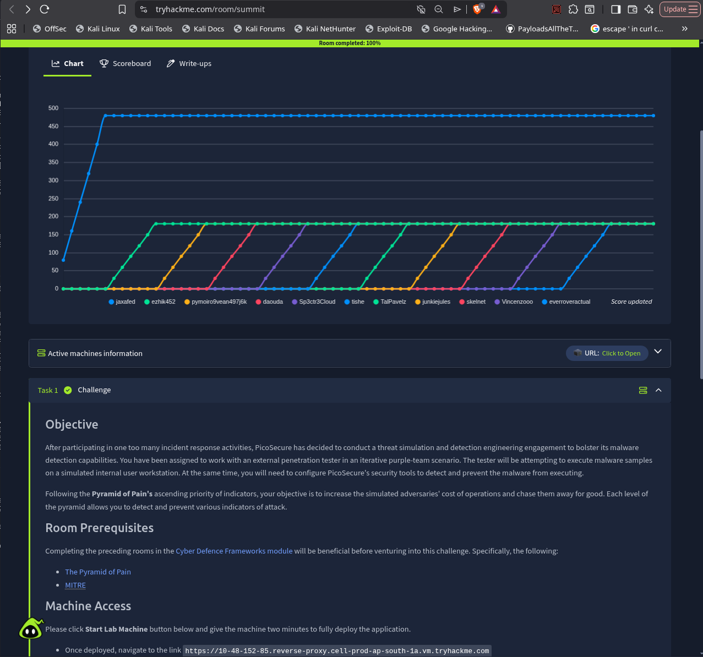
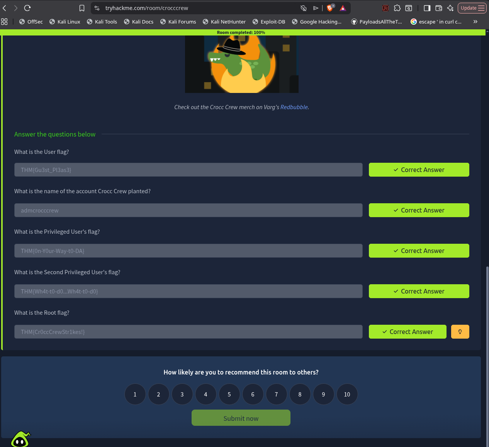

# THM - Summit

In real scenarios, I've seen subnets being used to control what service/microservice can talk to what other service/microservice. And there's an org-wide intranet that is only accessible from the internal network and the services can mostly only talk to this intranet. 

Also, for external services, there's usually a reverse proxy that handles the external traffic and forwards it to the internal services. And even this is heavily monitored and controlled. 

The most effective approach is a white-list, instead of a black-list. If you have a service that needs to talk to another service, you can add it to the white-list. 

This one was easy, hardly 10 minutes. For i've done it before on production scale as a part of dev-ops escalation. But yes, got some insights...

